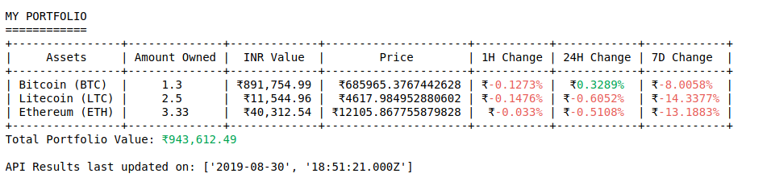

# Manage your Cryptocurrency Portfolio

### Final Output:
---



---

#### import libraries
1. requests ------- for data query
1. prettytables --- for displaying the tabular data in terminal
1. colorama ------- for color manipulation in terminal 

```python
import os
import json
from requests import Request, Session
from prettytable import PrettyTable
from colorama import Fore, Back, Style
```

#### create the requests session
add your coinCapGLobal API key.
I have used the sandbox API


```python
url = 'https://sandbox-api.coinmarketcap.com/v1/cryptocurrency/listings/latest'

parameters = {
  'convert':'INR'
}

headers = {
  'Accepts': 'application/json',
  'X-CMC_PRO_API_KEY': '<YOUR API KEY HERE>',
}

session = Session()
session.headers.update(headers)
```


```python
try:
  response = session.get(url, params=parameters)
  res = json.loads(response.text)
except (ConnectionError, Timeout, TooManyRedirects) as e:
  print(e)
```

```python
data = res['data']
data[0]
```


    {'id': 1,
     'name': 'Bitcoin',
     'symbol': 'BTC',
     'slug': 'bitcoin',
     'num_market_pairs': 7919,
     'date_added': '2013-04-28T00:00:00.000Z',
     'tags': ['mineable'],
     'max_supply': 21000000,
     'circulating_supply': 17906012,
     'total_supply': 17906012,
     'platform': None,
     'cmc_rank': 1,
     'last_updated': '2019-08-30T18:51:28.000Z',
     'quote': {'INR': {'price': 685965.3767442628,
       'volume_24h': 985252019788.2831,
       'percent_change_1h': -0.1273,
       'percent_change_24h': 0.3289,
       'percent_change_7d': -8.0058,
       'market_cap': 12282904267567.291,
       'last_updated': '2019-08-30T18:51:02.000Z'}}}


```python
ticker_url_pairs = {}

for currency in data:
    symbol = currency['symbol']
    url = currency['id']
    ticker_url_pairs[symbol] = url
ticker_url_pairs
```


    {'BTC': 1,
     'ETH': 1027,
     'XRP': 52,
     'BCH': 1831,
     'LTC': 2,
     'USDT': 825,
     'EOS': 1765,
     'BNB': 1839,
     'BSV': 3602,
     'XLM': 512,
     'XMR': 328,
     'ADA': 2010,
     'LEO': 3957,
     'TRX': 1958,
     'DASH': 131,
     'ETC': 1321,
     'XTZ': 2011,
     'MIOTA': 1720,
     'LINK': 1975,
     'NEO': 1376,
     'MKR': 1518,
     'USDC': 3408,
     'XEM': 873,
     'ATOM': 3794,
     'ONT': 2566,
     'CRO': 3635,
     'ZEC': 1437,
     'DOGE': 74,
     'VSYS': 3704,
     'DCR': 1168,
     'LAMB': 3657,
     'VET': 3077,
     'BAT': 1697,
     'QTUM': 1684,
     'PAX': 3330,
     'TUSD': 2563,
     'BTG': 2083,
     'HT': 2502,
     'BTM': 1866,
     'HEDG': 3662,
     'OMG': 1808,
     'RVN': 2577,
     'LSK': 1214,
     'NANO': 1567,
     'KCS': 2087,
     'BCD': 2222,
     'ALGO': 4030,
     'THETA': 2416,
     'INB': 3116,
     'WAVES': 1274,
     'BTT': 3718,
     'HOT': 2682,
     'NRG': 3218,
     'ICX': 2099,
     'DGB': 109,
     'EGT': 2885,
     'ZRX': 1896,
     'BTS': 463,
     'HC': 1903,
     'NPXS': 2603,
     'REP': 1104,
     'AOA': 2874,
     'IOST': 2405,
     'MONA': 213,
     'NEX': 3829,
     'KMD': 1521,
     'DAI': 2308,
     'QNT': 3155,
     'MAID': 291,
     'SC': 1042,
     'XVG': 693,
     'RIF': 3701,
     'ZIL': 2469,
     'AE': 1700,
     'GNT': 1455,
     'ETP': 1703,
     'STEEM': 1230,
     'SNT': 1759,
     'ARDR': 1320,
     'REN': 2539,
     'QKC': 2840,
     'MCO': 1776,
     'GXC': 1750,
     'ABBC': 3437,
     'ENJ': 2130,
     'WTC': 1925,
     'XZC': 1414,
     'SNX': 2586,
     'SOLVE': 3724,
     'WAX': 2300,
     'BEAM': 3702,
     'WAN': 2606,
     'STRAT': 1343,
     'ELF': 2299,
     'ELA': 2492,
     'GRIN': 3709,
     'NEXO': 2694,
     'PAI': 2900,
     'ETN': 2137,
     'PZM': 1681}


#### create your portfolio from the data received


```python
portfolio_value = 0.00
convert = 'INR'
last_updated = 0
table = PrettyTable(['Assets', 'Amount Owned', convert + ' Value', 'Price', '1H Change', '24H Change', '7D Change'])
```


```python
with open('portfolio.txt') as inp:
    for line in inp:
        ticker, amount = line.split()
#         print(type(amount))
        ticker = ticker.upper()
#         print(ticker)
        for i in range(len(data)):
            if data[i]['symbol'] == ticker:
                currency = data[i]
#                 print(currency)
                rank = currency['cmc_rank']
                name = currency['name']
                last_updated = currency['last_updated']
                symbol = currency['symbol']
                quotes = currency['quote'][convert]
                hour_change = quotes['percent_change_1h']
                day_change = quotes['percent_change_24h']
                week_change = quotes['percent_change_7d']
                price = quotes['price']

                value = float(price) * float(amount)
                value_string = '{:,}'.format(round(value, 2))

                portfolio_value += value
                
                if hour_change>0:
                    hour_change = Fore.GREEN + str(hour_change) + '%' + Style.RESET_ALL
                else:
                    hour_change = Fore.RED + str(hour_change) + '%' + Style.RESET_ALL

                if day_change>0:
                    day_change = Fore.GREEN + str(day_change) + '%' + Style.RESET_ALL
                else:
                    day_change = Fore.RED + str(day_change) + '%' + Style.RESET_ALL

                if week_change>0:
                    week_change = Fore.GREEN + str(week_change) + '%' + Style.RESET_ALL
                else:
                    week_change = Fore.RED + str(week_change) + '%' + Style.RESET_ALL

                table.add_row([name + ' (' + symbol + ')',
                               amount,
                              '₹' + value_string,
                              '₹' + str(price),
                              '₹' + str(hour_change),
                              '₹' + str(day_change),
                              '₹' + str(week_change)])
```


```python
print()
print('MY PORTFOLIO')
print('============')
print(table)
portfolio_value_string = '{:,}'.format(round(portfolio_value, 2))
print('Total Portfolio Value: ' + Fore.GREEN + '₹'+ portfolio_value_string + Style.RESET_ALL)
print()
print('API Results last updated on: ' + str(last_updated.split('T')))
```


#### Over!
